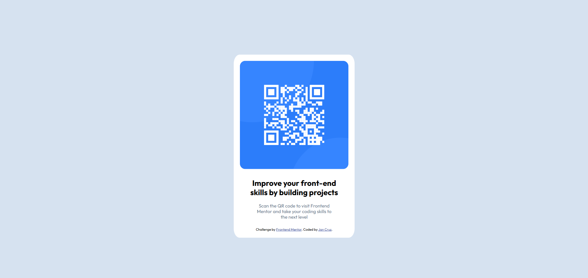

# Frontend Mentor - QR code component solution

This is a solution to the [QR code component challenge on Frontend Mentor](https://www.frontendmentor.io/challenges/qr-code-component-iux_sIO_H). Frontend Mentor challenges help you improve your coding skills by building realistic projects. 

## Table of contents

- [Overview](#overview)
  - [Screenshot](#screenshot)
  - [Links](#links)
- [My process](#my-process)
  - [Built with](#built-with)
  - [What I learned](#what-i-learned)
  - [Continued development](#continued-development)
  - [Useful resources](#useful-resources)
- [Author](#author)
## Overview

### Screenshot




### Links

- Solution URL: [Add solution URL here](https://your-solution-url.com)
- Live Site URL: [Add live site URL here](https://your-live-site-url.com)

## My process

### Built with

- Semantic HTML5 markup
- CSS custom properties
- Flexbox

### What I learned

My major learning while working through this project was figuring out the @media screen. This is my first time using @media screen, had to research and adjust the CSS code appropiately.


```css
@media screen (width >= 769px)
    body{
        background-color: hsl(212, 45%, 89%);
        display: flex;
        justify-content: center;
        transform: translate(0%, 30%);
    }
```
### Continued development

I would like to continue practicing flexbox and @media screen with future projects.

### Useful resources

- [MDN Web Docs](https://developer.mozilla.org/en-US/docs/Web/CSS/CSS_media_queries/Using_media_queries) - This helped me for @media screen because it provided a variety of codes for diferrent features. I really liked the resource and will use it going forward.
- [W3Schools](https://www.w3schools.com/) - This is another site I use for the flexbox. It provided a few simple concept to understand what I needed to do with flexbox.

## Author

- Website - [Jan Cruz](https://www.your-site.com)
- Frontend Mentor - [@fliche01](https://www.frontendmentor.io/profile/fliche01)
- Github - [@fliche01](https://github.com/fliche01)
